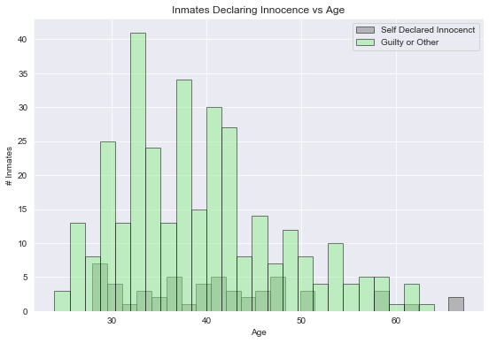
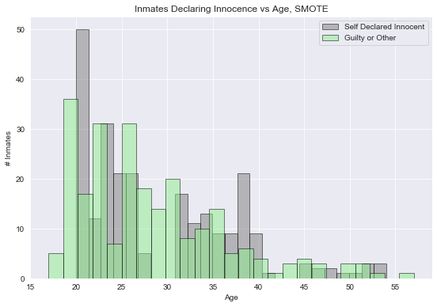
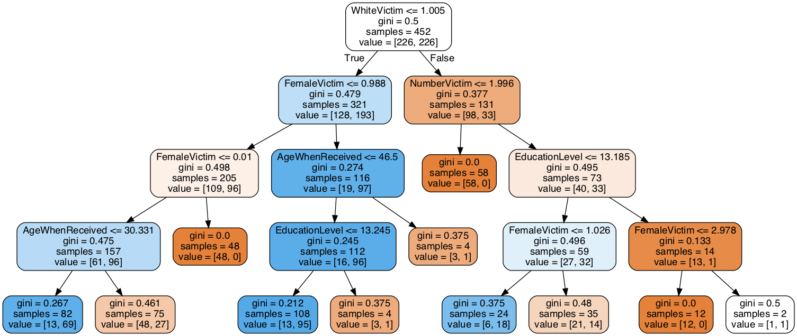
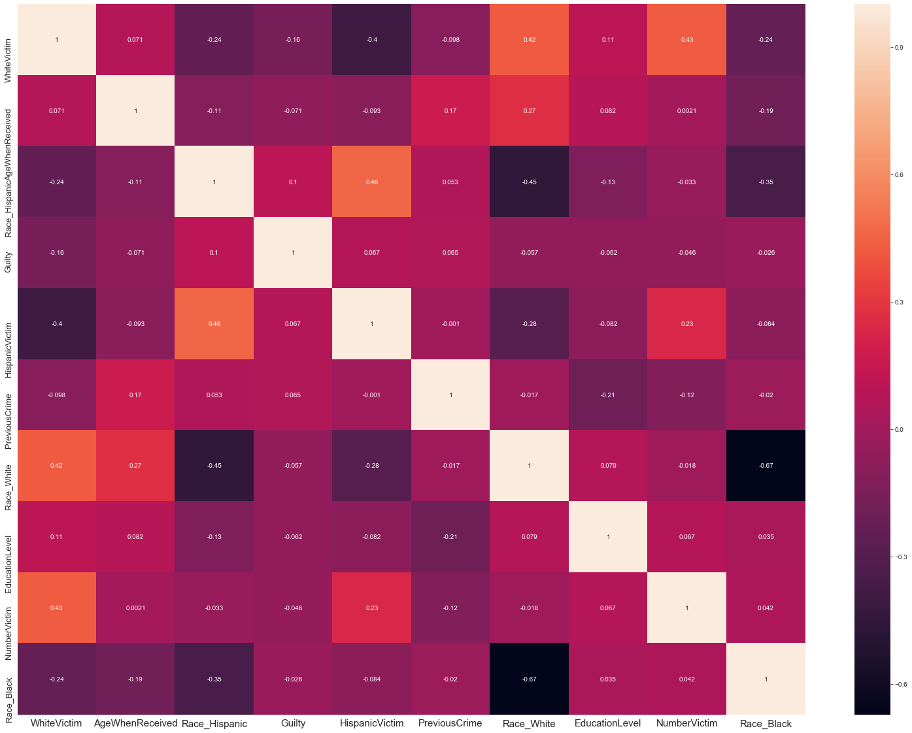
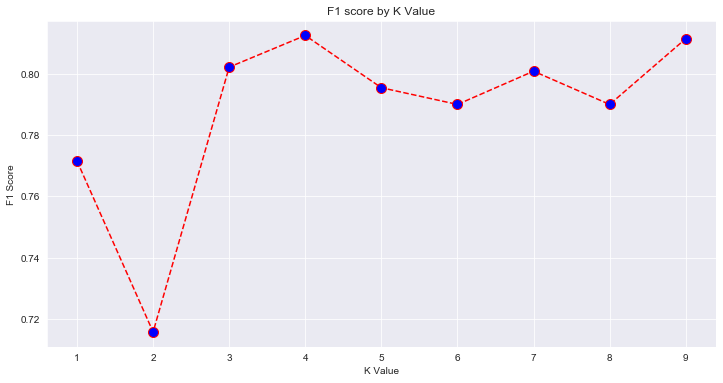

# death-row-last-words

Goal: Categorize and predict death row inmates claiming innocence in their official last words statement by the race, age, race of victim, previous crimes, and education level through machine learning algorithms.

Data: 
- Kaggle dataset (https://www.kaggle.com/mykhe1097/last-words-of-death-row-inmates)
- Filtered last words statements by certain words/phrases to determine whether the inmate claimed innocence. Such words include, "did not do", "innocent", "did not murder", and "truth.

Process:
- Used SMOTE to resample and create synthetic data points to combat the class imbalance, since innocence-claiming inmates were a huge minority.

- Ran a decision tree after resampling, tuned and pruned the tree using a validation curve, gridsearch, and a randomforest.

- Obtained the most important features using sklearn

- Implemented K Nearest Neighbors and AdaBoost model

Conclusions:
- K-Nearest Neighbors ended up being the most accurate model.
- One of the biggest indicators of proclaimed innocence among all models was whether or not their victim was white.

